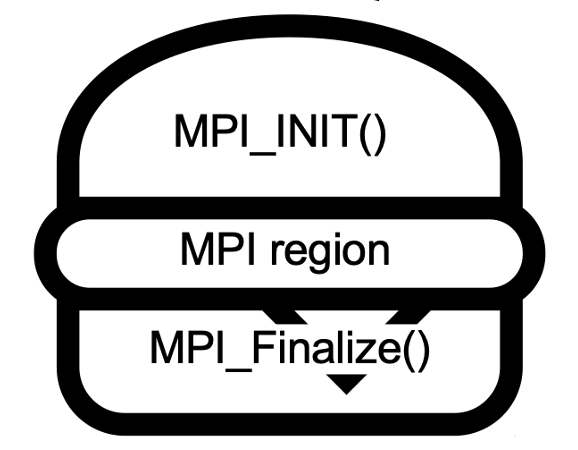
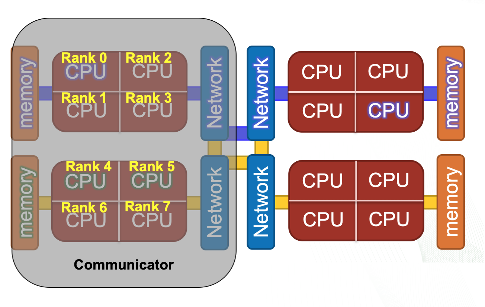

# What is MPI? 

The **M**essage **P**assing **I**nterface (MPI) is a set of library functions, methods, and specifications that can be called to distribute a code's processing work between nodes or processors on the same node.  It does this by passing messages between the processors. It is governed by a set of community driven standards. The MPI standard can be found here: [MPI: A Message-Passing Interface Standard Version 3.1]( https://www.mpi-forum.org/docs/mpi-3.1/mpi31-report.pdf). 

The basic flow of MPI within in a program is:
1. Initialize communication 
2. Communicate between processes to share data
3. Exit the communication


This neat encapsulation of data and instructions in portable messages allows different processes to run on nodes that have different pools of memory. Each process has its own unique copy of the data, variables, and instructions for its task. 

MPI also works well on nodes where processing elements share memory, but other parallel methods designed for shared memory may be more efficient in that situation. MPI is often used in conjunction with OpenMP and other shared-memory threading methods.  For example, you might use MPI to pass work between compute nodes and then use OpenMP threads to divide work among the different processing elements on the node. 

This challenge will explore an MPI helloworld and two kinds of MPI communication patterns. We will use C code and pass its work with MPI between CPU cores on the same node so that we have enough nodes available for everyone to do this at once.


# MPI Terminology  
 
**Communicator**   An object that represents a group of processes than can communicate with each other. 

**Rank** Within a communicator each process is given a unique integer ID. Ranks start at 0 and are incremented contiguously. Ranks can be mapped to hardware processing elements like CPU cores. 

**Size** The total number of ranks in a communicator.

**MPI Region** The part of the code that will be executed in parallel using one MPI communicator. It will always be sandwiched between  MPI_Init and 
MPI_Finalize function calls.


<br>
<center>

</center>
<br>

**The Communication Sandwich**                                  


For a typical MPI program, the number of ranks is set by the programmer in the command used to run the program. This allows the programmer to try differnt numbers of processes per task without needing to change the code. 

The first thing MPI does when it is initialized, is set up the communicator. You can think of a communicator as a package that holds all the needed organizational information for its MPI region in the code. Inside the communicator each process is given a rank. The size of the communicator is equal to its total number of ranks. 

All MPI function calls within the same MPI region will get each process’s rank from the communicator. The programmer must use logic, based on the MPI rank's ID to differentiate the code paths. 

<br>
<center>

</center>
<br>


**A communicator of size 8, with 8 ranks that map to 8 processes running on 8 CPU cores.** 

# Example: MPI Functions and Helloworld

MPI consists of hundreds of functions, but most users will only use a handful of them. 
We'll start by looking at the functions needed for an MPI Helloworld program. 

Below is an outline for the program and its MPI functions. For this challenge, review the outline and then try to use it to find the missing MPI function in your copy of mpi_hello.c 


**Helloworld Outline**

Now we will look at an outline of the program.


* First initialize  MPI. 
  
  This is done with a function:

  ```
  MPI_Init(&argc, &argv);
  ```
When the MPI_Init function is called, all of MPI's global and internal variables are constructed.  A communicator is setup to contain all of the processes that were spawned, and unique ranks are assigned to each process. The arguments argc and argv are empty in this case. Do not focus on them for now. 

* Next get the number (size) of processes from the communicator. 
  
  This is done with another MPI function: 
  
  ```
  MPI_Comm_size(MPI_COMM_WORLD, &size); 
  ```
  In this case, the communicator is named MPI_COMM_WORLD. This function returns the size of the communicator which is equal to the number of ranks. 
 
* Next get the rank ID of each process from the communicator. 
  
  This is also done with an MPI function: 
  ```
  MPI_Comm_rank(MPI_COMM_WORLD, &rank);
  ```
  Ranks are IDs used for sending and receiving messages for each process. 

* Print "Hello" from each rank distributed on each processor. This is just C code. 


* Finalize MPI. 
  Yet another MPI function. 
  ```
  MPI_Finalize();
  ```
  This function cleans up MPI and releases the communicator. No MPI functions will be recognized below this function. 

Now it is your turn. Use the outline to help find and enter the missing MPI function in mpi_hello.c.


**Execution **

Fill in the TODO lines. They are relatively simple. We will setup this example to use 4 ranks, each mapped to a separate core on the node. 
To compile:

```
make
```

To run: 

```
srun -n 4 -c 1 ./hello

```

This submission will ask for 1 node with 4 MPI ranks and one rank on each core. Thus, the size (number of ranks) that gets passed to MPI is 4. 
If it succeeded, you should see the following output: 

```
Hello from rank 3 of 4 total
Hello from rank 2 of 4 total
Hello from rank 1 of 4 total
Hello from rank 0 of 4 total
```

If you wanted to run with 10 ranks, you would change the srun line in the submission script:

from

```
srun -n 4 -c 1 ./hello
```
to

```
srun -n 10 -c 1 ./hello
```

We mention this because a nice feature of MPI programs that are structured like this, is that the user can change the size of the problem from the submit file without making changes in the code that would require it to be recompiled.

